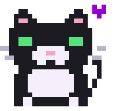

<!-- ⚠️ IMPORTANTE: faça upload do arquivo mickey.gif na RAIZ deste repositório, senão o gatinho não aparece! -->

<!-- 💜 Capa -->


<!-- 💬 Texto digitando -->
<div align="center">

  <a href="https://readme-typing-svg.demolab.com">
    
  </a>

  

</div>

## 💜 About me

<!-- 🐱 O Mickey pixel art (arquivo mickey.gif deste repositório) -->


- 💻 **Front-End Developer** — in love with clean, beautiful interfaces
- 🎂 18 years old, from **Boa Viagem – CE, Brazil**
- 📚 Deep-diving into **HTML, CSS & JavaScript**
- 📫 **paulanatali025@gmail.com**

<br clear="both"/>

## 🐱 Mickey.exe

<div align="center">

```text
               ╭──────────────────────────╮
  /\_____/\    │ MICKEY.EXE ─ running     │
 (  o   o  )   │ breed : tuxedo (frajola) │
 ( == ^ == )   │ role  : CEO of this page │
  )       (    │ mood  : judging my CSS   │
 (__)___(__)   ╰──────────────────────────╯
```

</div>

## 🛠️ Tech Stack

<div align="center">

**Front-End**

<a href="https://skillicons.dev"></a>

**Back-End & Database**

<a href="https://skillicons.dev"></a>

**Tools**

<a href="https://skillicons.dev"></a>

</div>

## 📊 GitHub Stats

<div align="center">
  
  
</div>

<br/>

<div align="center">
  
</div>

<br/>


## 🌐 Let's connect

<div align="center">
  <a href="https://github.com/paulanatali"></a>
  &nbsp;
  <a href="mailto:paulanatali025@gmail.com"></a>
</div>

<!-- 🐍 COBRINHA DESATIVADA (por enquanto). Para ativar:
1) Crie o arquivo .github/workflows/snake.yml neste mesmo repositório, com o conteúdo que te enviei
2) Vá na aba Actions do repositório, escolha "Generate snake animation" e clique em "Run workflow"
3) Quando o workflow terminar (fica verde), apague SOMENTE a primeira linha deste bloco e a última linha, e a cobrinha vai aparecer

## 🐍 Even the snake is purple

<div align="center">
  <picture>
    <source media="(prefers-color-scheme: dark)" srcset="https://raw.githubusercontent.com/paulanatali/paulanatali/output/github-snake-dark.svg"/>
    <source media="(prefers-color-scheme: light)" srcset="https://raw.githubusercontent.com/paulanatali/paulanatali/output/github-snake.svg"/>
    
  </picture>
</div>

FIM DO BLOCO DA COBRINHA -->

<div align="center">

**Made with 💜 by Paula Natali** — supervised by Mickey 🐾

</div>

<!-- 💜 Rodapé -->

